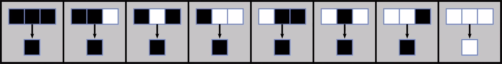

# Elementary-cellular-automata

## Description

Elementary cellular automata in Java.\
The program will print squares on the terminal using a set of rules define in *rules.save* file. It could be any file but it must follow the same patern inside the file.

--------
## Rules file
The rule flie should follow the same patern as *rules.save*
```
FIRSTLINE=0000001000000
LOOP=5
000=0
001=0
100=0
101=0
010=0
011=0
110=0
111=1

```
0 = ⬛ | 1 = ⬜\
*FIRSTLINE* will define how the program will start and you can choose the length\
*LOOP* will define the number of step you want to print\
For the 8 other lines you will define the result of all of these cases\


--------
## Usage Example

Here is a quick example of how to use it

```
java -cp Final.main rules.save
```


--------
## Installation

```
git clone https://github.com/Noblerie/Elementary-cellular-automata.git
cd Elementary-cellular-automata
```